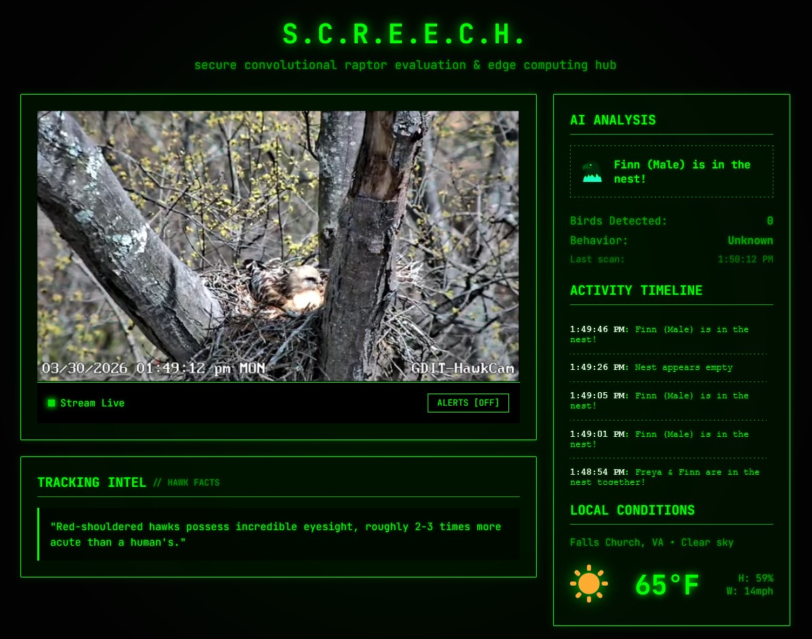

# S.C.R.E.E.C.H. 🦅
**(Secure Convolutional Raptor Evaluation & Edge Computing Hub)**

A localized, cyberpunk-themed AI dashboard designed to track live activity from the GDIT Red-shouldered Hawk nest. Built directly on top of the live YouTube stream feed.

> **Disclaimer:** This is an unofficial, personal project created by a GDIT employee. The live video stream and nest location belong to GDIT (General Dynamics Information Technology) at their corporate headquarters. This software/tracker is not officially endorsed by, maintained by, or affiliated with GDIT's corporate operations.



## 🚀 Features

- **Live AI Analysis:** Utilizes `YOLOv8n` via OpenCV and a custom Python `asyncio` loop to continuously parse a live YouTube stream from Open-Meteo.
- **Behavior Tracking:** Evaluates the vertical variance of the Hawks over time to accurately determine if they are **Active** or **Incubating**.
- **Cyber Aesthetic:** A dark, matrix-inspired frontend interface featuring pure neon greens, JetBrains Mono typography, and seamless blocky architecture.
- **Activity Timeline & DB Tracker:** A lightweight SQLite backend tracks significant timeline events (such as 'Nest appears empty' or 'Hawk is in the nest!') to an activity feed.
- **Push Notification integration:** Native `Browser Notification API` integrations warn you if a Hawk suddenly returns.
- **Live Weather Integration:** Syncs Falls Church, VA weather utilizing the open-source Open-Meteo API, displayed with retro clip-art style emojis.

## 🛠️ Installation & Usage

### 1. Requirements
Ensure Python is installed and ready on your system.
```bash
python -m venv venv
.\venv\Scripts\Activate.ps1
pip install -r backend/requirements.txt
```

### 2. Startup
Run the server using Uvicorn.
```bash
cd backend
uvicorn server:app --host 0.0.0.0 --port 8000
```

Access the terminal interface locally at `http://localhost:8000`.
