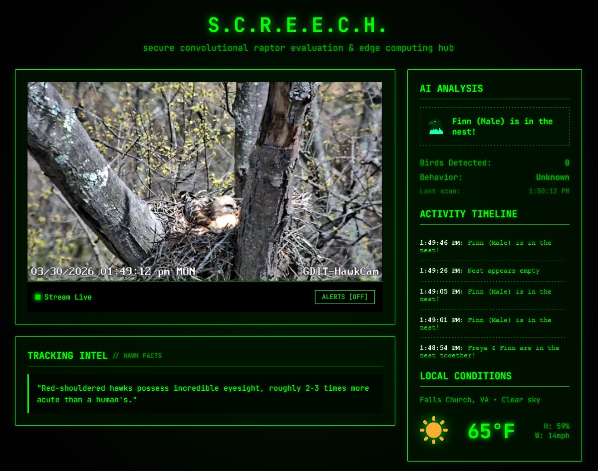

# S.C.R.E.E.C.H. 🦅
**Secure Convolutional Raptor Evaluation & Edge Computing Hub**

S.C.R.E.E.C.H. is a local, cyberpunk-themed AI dashboard for tracking activity from the GDIT Red-shouldered Hawk nest. It can analyze the live YouTube feed during nesting season or run against saved clips in the offseason for repeatable testing and tuning.

> **Disclaimer:** This is an unofficial personal project created by a GDIT employee. The live video stream and nest location belong to GDIT (General Dynamics Information Technology). This software is not officially endorsed by, maintained by, or affiliated with GDIT corporate operations.



## What it does

- **Live or fixture video analysis** using Ultralytics YOLO and OpenCV.
- **Persistent live frame capture** so inference samples the newest available frame instead of reconnecting to YouTube for every scan.
- **Stable nest-state tracking** with separate raw detections and debounced state changes.
- **Experimental Freya/Finn identity heuristic** based on detected bird size, with an uncertainty band rather than forcing every one-bird detection into a name.
- **Behavior signal** using normalized vertical movement and labels such as `Active / Moving` rather than claiming motion is definitely feeding.
- **Event snapshots and detection crops** for arrivals/departures and future model tuning.
- **SQLite timeline + minute-level observations** with automatic migration of the original event database.
- **7-day occupancy/activity telemetry** in the dashboard.
- **Cached Open-Meteo weather** so open dashboards do not make a weather request every five seconds.
- **Browser notifications** for stable state changes.
- **Health endpoint** for model, source, frame age, and database status.
- **Offseason regression tooling** for discovering GDIT Hawk Cam uploads, downloading timestamped local clips, and running the detector over them.

## Requirements

- Python **3.10+**
- A supported PyTorch environment for your machine (installed by Ultralytics in the normal pip/uv path)
- Internet access during first model load so Ultralytics can fetch the configured model if it is not already cached
- Internet access to YouTube during live operation
- `ffmpeg` if you want precise timestamped clip extraction with `tools/fetch_test_clips.py`

The project intentionally stays framework-light: FastAPI on the backend and plain HTML/CSS/JS on the frontend.

## Install

### uv

From the repository root:

```powershell
uv sync
```

Run:

```powershell
uv run uvicorn backend.server:app --host 0.0.0.0 --port 8000
```

### pip / venv

```powershell
python -m venv .venv
.\.venv\Scripts\Activate.ps1
python -m pip install -r backend\requirements.txt
python -m uvicorn backend.server:app --host 0.0.0.0 --port 8000
```

On Windows you can also run:

```text
start.bat
```

Then open `http://localhost:8000`.

## Configuration

Copy `.env.example` to `.env` if you want a reference, then export/set the values you need before startup. Uvicorn can also load it directly:

```powershell
uv run uvicorn backend.server:app --env-file .env --host 0.0.0.0 --port 8000
```

Important settings:

| Variable | Default | Purpose |
| --- | --- | --- |
| `SCREECH_VIDEO_ID` | `HRhToy9dA-Q` | Live YouTube video ID |
| `SCREECH_VIDEO_SOURCE` | empty | Override with a local file, direct stream URL, or YouTube URL |
| `SCREECH_MODEL` | `yolo26n.pt` | Ultralytics model |
| `SCREECH_DETECTOR_CONFIDENCE` | `0.08` | Generic bird detector confidence |
| `SCREECH_MIN_BOX_AREA_RATIO` | `0.005` | Ignore tiny bird boxes |
| `SCREECH_IDENTITY_MODE` | `size` | `size` or `generic` |
| `SCREECH_FEMALE_AREA_RATIO` | `0.08` | Center of the experimental size heuristic |
| `SCREECH_IDENTITY_DEADBAND` | `0.01` | Uncertain area around the identity threshold |
| `SCREECH_SCAN_INTERVAL_SECONDS` | `5` | Detector cadence |
| `SCREECH_EMPTY_CONFIRMATIONS` | `8` | Empty scans before empty becomes a candidate state |
| `SCREECH_STATE_CONFIRMATIONS` | `3` | Candidate scans required before a stable transition |
| `SCREECH_OBSERVATION_INTERVAL_SECONDS` | `60` | Stats sampling cadence |
| `SCREECH_SAVE_SNAPSHOTS` | `true` | Save annotated transition frames |
| `SCREECH_SAVE_CROPS` | `true` | Save detected bird crops for future training |
| `SCREECH_WEATHER_TTL_SECONDS` | `600` | Open-Meteo cache lifetime |

The original `backend/hawk_data.db` location remains the default so existing history is preserved. New columns are added automatically.

## Offseason testing with GDIT Hawk Cam clips

Video fixtures are deliberately not checked into Git. Instead, the repo includes tooling to build a local regression set from the public GDIT Hawk Cam channel.

Discover recent uploads:

```powershell
uv run python tools\fetch_test_clips.py discover
```

This writes `tests/fixtures/discovered.json`. Review the videos and choose timestamp ranges that cover useful cases:

- empty nest
- one hawk resting
- one hawk moving
- both hawks present
- arrival and departure transitions
- partial occlusion
- unusual lighting / weather
- false-positive birds or background shapes

Copy the example manifest:

```powershell
copy tests\fixtures\clips.example.json tests\fixtures\clips.json
```

Add the chosen URLs and timestamps, then fetch only those short sections:

```powershell
uv run python tools\fetch_test_clips.py fetch
```

Analyze a saved clip without running the web server:

```powershell
uv run python tools\analyze_clip.py tests\fixtures\clips\hawk_arrival.mp4
```

That writes JSON detections plus annotated sampled frames. This is the intended workflow for comparing models and thresholds before the next nesting season.

You can also run the full dashboard against a local fixture:

```powershell
set SCREECH_VIDEO_SOURCE=C:\path\to\hawk_clip.mp4
set SCREECH_SCAN_INTERVAL_SECONDS=0.25
uv run uvicorn backend.server:app --host 127.0.0.1 --port 8000
```

Local fixture files loop by default.

## API

- `GET /api/status` — stable and raw detector state
- `GET /api/timeline` — recent stable state changes with optional snapshot URLs
- `GET /api/stats?days=7` — occupancy/activity percentages from sampled observations
- `GET /api/weather` — cached local weather
- `GET /api/facts` — rotating hawk fact
- `GET /api/health` — model/source/database health
- `GET /api/data` — dashboard bulk endpoint

Runtime snapshots are served from `/snapshots/...`.

## Detection notes

The current model still detects the generic COCO `bird` class; this is not yet a species-specific hawk model.

Freya/Finn naming remains an **experimental size heuristic** because female Red-shouldered Hawks are larger. S.C.R.E.E.C.H. now has an uncertainty band and stores event crops specifically so that a real identity classifier can be trained later. Set:

```text
SCREECH_IDENTITY_MODE=generic
```

to disable identity guesses entirely.

Likewise, `Active / Moving` means the normalized vertical center of the detected bird is moving enough to cross the configured threshold. It intentionally does not claim that every such motion is feeding.

## Development checks

The lightweight test suite does not download YOLO/PyTorch models:

```powershell
uv run --extra dev pytest -q
```

CI also compiles all Python sources and runs the state-machine/database tests.

## Project layout

```text
backend/
  config.py       environment-driven settings and absolute paths
  database.py     SQLite schema, migration, events, observations, stats
  detector.py     YOLO inference, identity heuristic, motion signal, annotations
  processor.py    live/local video source handling and processing loop
  services.py     cached weather and facts
  state.py        pure debounced nest-state machine
  server.py       FastAPI app and lifespan
frontend/
  index.html
  app.js
  style.css
tools/
  fetch_test_clips.py
  analyze_clip.py
tests/
  test_state.py
  test_database.py
  fixtures/
```
